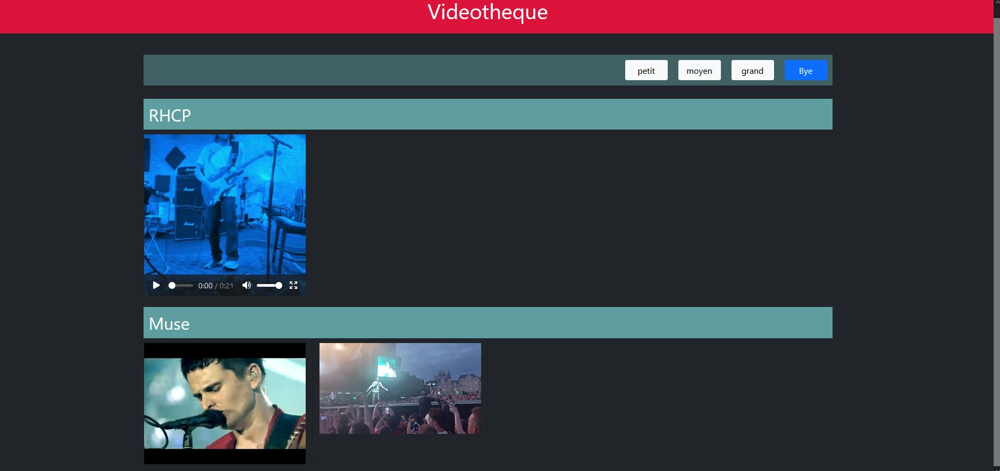
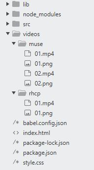
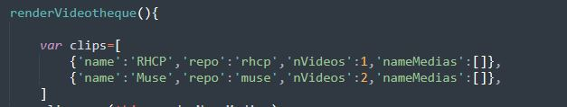

# Videotheque - Application Web

## Pour quoi faire ?
Parcourez et regardez vos vidéos persos à partir de votre navigateur. 



## Comment ça marche ?
- Vous téléchargez d'abord le programme sur votre machine.
- Vous collez ensuite vos vidéos au format .mp4 dans le dossier "videos" selon une logique de rangement précise, et un zeste de code ; que je vous explique après.
- Enfin, vous cliquez sur le fichier index.html pour lancer l'application dans votre navigateur.

Une fois là, parcourez et regardez vos vidéos, et modifiez leur taille selon vos préférences de visionnage. 


## Les outils indispensables : npm et Babel 
Videotheque est une application React. Pour que l'appli affiche votre vidéos dans votre navigateur, vous devrez faire un tout petit peu de JSX, et convertir ce JSX en Javascript.

C'est là qu'entre en jeu Babel, et npm, puisque le gestionnaire de paquets Javascript appellera pour vous Babel, et lui demandera de traduire le code JSX (que vous écrirez dans les fichiers du dossier src), 
en Javascript (cf les fichiers du dossier lib récupérés par index.html).

Je vous explique après la partie codage et ligne de commandes (cf Logique de rangement des vidéos). Je vous dis d'abord comment avoir ces outils (npm et Babel) sur son ordi.

Pour installer npm, il faut installer l'interpréteur de code Javascript Node.js ; direction cette [jolie page](https://nodejs.org/en/download/). Pour installer Babel, RDV avec votre invite de commandes chéri à la racine de l'application web (là où se trouve index.html), et lancez la commande suivante (cf [la doc de Babel](https://babeljs.io/setup#installation)) :
```
npm install --save-dev @babel/core @babel/cli 
```
Vous pouvez maintenant utiliser Babel et bidouiller tranquillement l'appli avec React !

## Logique de rangement des vidéos :
Il faut respecter un ordre de rangement des vidéos, et convoquer Babel, pour afficher vos vidéos sur l'application web.

### Organisation des vidéos :
Tout se passe dans le dossier "video".

Là-bas vous créez autant de dossiers que vous voulez. Ces dossiers contiendront vos vidéos. 3 points à observer :
- Le nom de ces dossiers est important dans la mesure où il sera repris dans le code.
- Les videos dans chaque dossier doivent être nommées de 01 à n ; où n correspond à la dernière vidéo du dossier : s'il y a 4 vidéos dans le dossier n sera "04", et s'il y a 11 vidéos n vaudra "11".
- De plus chaque video doit avoir une image png d'illustration, qui servira de "poster" pour la balise html "video". Chaque image doit avoir le même nom que la vidéo qu'elle illustre. 

Pour être plus clair, je vous glisse la capture suivante où j'ai rangé 3 vidéos : 1 pour le groupe des Red Hot Chili Peppers, et 2 autres pour Muse.



### Signalez à l'application l'ajout de nouvelles vidéos :
Pour que vos vidéos apparaissent sur la page web, vous devez signaler à l'application l'ajout de vos vidéos dans le dossier "videos".

Pour ça, direction le fichier Videotheque.js du dossier "src". Vous allez dans la méthode renderVideotheque(), et compléter le "dictionnaire" (tableau d'objets si vous préférez) nommé clips . Vous ajoutez à cette variable 
autant d'objets que vous avez ajouté de dossiers dans le dossier "video".

Chaque objet a des clefs qu'il vous faudra compléter :
- 'name' aura pour valeur un string, correspondant au nom affiché sur la page web : "Muse" pour moi, avec mes 2 vidéos de ce groupe.
- 'repo' aura pour valeur un string, correspondant au nom du dossier qui contient des vidéos : "muse" pour moi, contient mes 2 vidéos du trio britannique.
- 'nVideos' aura pour valeur un int, correspondant au nombre de vidéos contenus dans un dossier : 2 vidéos pour moi, dans mon dossier "muse"

Pour être plus claire, je vous glisse une autre capture avec mes vidéos de musique :



C'est tout pour la partie code ;)

Il ne vous reste plus qu'à vous rendre en console à la racine de l'appli, pour appeler Babel et mettre à jour le fichier Videotheque.js du dossier lib.
La commande pour ça :
```
npm run build
```
## Des idées d'amélioration :
Ajoutez des titres aux vidéos, permettre l'intégration de vidéos autres des .mp4, modifiez la logique de rangement des vidéos pour conserver les noms d'origine de vos vidéos, ou encore changez l'apparence de l'appli...


